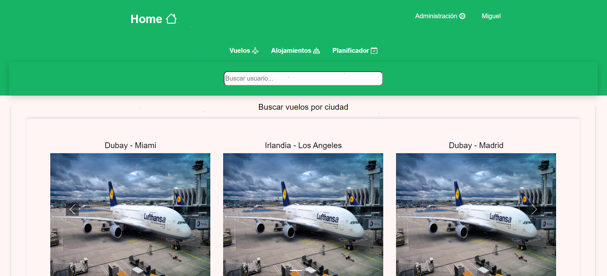
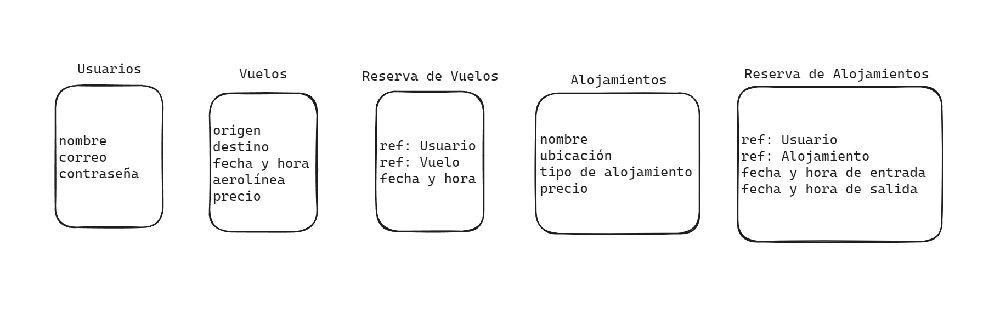
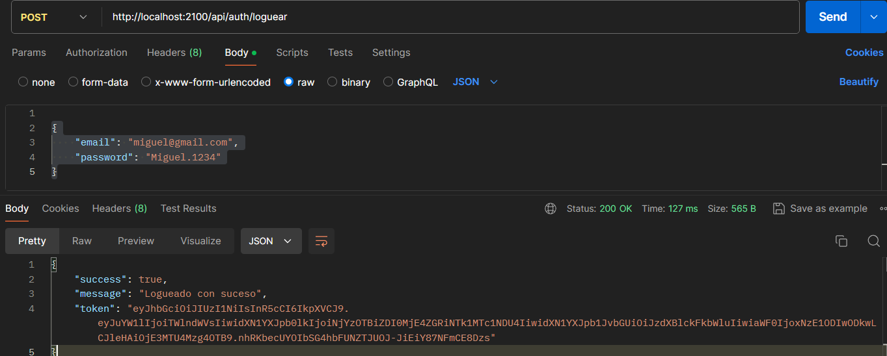
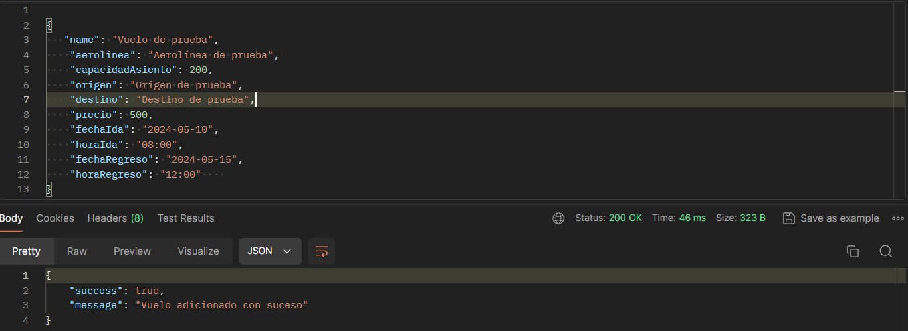
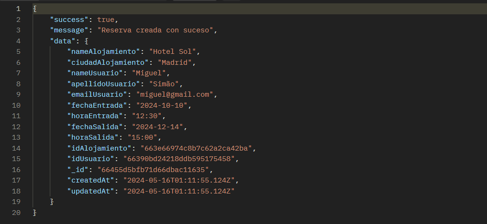

---

<ul>

<li><a href="#tecnologías">Tecnologías</a> </li>

<li><a href="#description">Description</a> </li>

<li> <a href="#urls">URLs</a> </li>

<li> <a href="#estructura-y-diseño-de-la-base-de-datos">Estructura y diseño de la base de datos</a> </li>

<li> <a href="#futuras-funcionalidades">Futuras Funcionalidades</a></li>
<li> <a href="#author">Author</a> </li>

</ul>

---

## Tecnologías


<a href="https://www.docker.com/"></a>
<a href="https://www.mongodb.com/es">  </a>
<a href="https://nodejs.org/en"></a>
<a href="https://expressjs.com/"></a>
<a href="https://www.typescriptlang.org/"></a>
<a href="https://github.com/Miguel21S"></a>
<a href="https://jwt.io/"></a>
<a href="https://www.postman.com/"></a>

---
## Description
El siguiente proyecto se desarrolla un sistema de planificación de viaje de parte del servidor. Es un sistema que gestionará información sobre agencias de viajens, alojamientos, ciudades y datos de usuarios cadastrado en el sistema.

---
## URLs

Autenticación

| Método | URI | Acción | Extra |
| --- | --- | --- |---|
| POST | /api/auth/register | Registrar usuario |
| POST | /api/auth/login | Loguear usuario |

Usuarios

| Método | URI | Acción | Extra |
| --- | --- | --- |---|
| GET | /api/users | Listar todos los usuarios (super_admin) |
| GET | /api/profil | Visualizar los datos del perfil |
| PUT | /api/users/profile/.id | Actualizar datos del perfil |Si |
| DELETE | /api/users/:id | Eliminar usuario del sistema (super_admin)|

Vuelo

| Método | URI | Acción | Extra |
| --- | --- | --- |---|
| GET | /api/vuelo | Listar todos los vuelo (super_admin)|
| POST | /api/vuelo | Adicionar vuelo (super_admin)|
| PUT | /api/vuelo | Actualizar vuelo por id (super_admin)|
| DELETE | /api/vuelo/{id} | Eliminar vuelo por id (super_admin)|

Reserva de Vuelo

| Método | URI | Acción | Extra |
| --- | --- | --- |---|
| POST | /api/reserva/vuelo/:id | Hacer reserva de vuelos|
| GET | /api/lista/reserva/vuelo | Listar reserva de vuelos (super_admin)|
| GET | /api/lista/mis/reserva/vuelo | Listar reserva de vuelos desde el perfil|
| DELETE | /api/reserva/vuelo/:id | Eliminar reserva de vuelo por id desde perfil de usuario|
| DELETE | /api/reserva/vuelo/:id | Eliminar reserva de vuelo por id (super_admin)|

Alojamientos

| Método | URI | Acción | Extra |
| --- | --- | --- |---|
| POST | /api/Alojamientos | Adicionar alojamientos (super_admin)|
| GET | /api/Alojamientos | Listar todos los alojamientos (super_admin)|
| PUT | /api/Alojamientos | Actualizar alojamientos por id (super_admin)|
| DELETE | /api/Alojamientos/:id | Eliminar alojamientos por id (super_admin)|

Reserva de Alojamientos

| Método | URI | Acción | Extra |
| --- | --- | --- |---|
| POST | /api/reserva/:id | hacer reserva de alojamientos|
| GET | /api/reserva | Listar Reserva de alojamientos (super_admin)|
| GET | /api/lista/mis/reserva | Listar todas reserva de alojamientos desde el perfil|
| PUT | /api/actualizar/reserva/:id | Actualizar reserva de alojamientos por id (super_admin)|
| DELETE | /api/eliminar/reserva/:id | Eliminar reserva de alojamientos por id desde perfil de usuario|
| DELETE | /api/eliminar/reserva/:id | Eliminar reserva de alojamientos por id (super_admin)|

El proyecto se encuentra en estado de construicción, a pesar de cumplir con todos los requisitos exigidos y algunos extras.

---
## Estructura y diseño de la base de datos


Para clonar repositorio

```jsx
$ git https://github.com/Miguel21S/ProyectoFinal.git
```
Para ejecución de seeders 

```jsx
$ npm run seeders
```

## Execución de rutas

Auth Controllers POST
```
http://localhost:2100/api/auth/register
```
```jsx
{
    "name":"Miguel",
    "apellido": 'SuperAdmin',
    "email":"miguel@gmail.com",
    "password": "Miguel.1234"
}
```

Iniciar sesión
http://localhost:2100/api/auth/loguear
```jsx
```
```jsx
{
    "email": "miguel@gmail.com",
    "password": "Miguel.1234"
}
```
 

Adicionar vuelo
```jsx
http://localhost:2100/api/auth/vuelo

```
```jsx
{
   "name": "Vuelo de prueba",
    "aerolinea": "Aerolínea de prueba",
    "capacidadAsiento": 200,
    "origen": "Origen de prueba",
    "destino": "Destino de prueba",
    "precio": 500,
    "fechaIda": "2024-05-10",
    "horaIda": "08:00",
    "fechaRegreso": "2024-05-15",
    "horaRegreso": "12:00"    
} 
```


---

Crear reserva de alojamiento
```jsx
http://localhost:2100/api/crear/reserva/663e66974c8b7c62a2ca42ba

```
```jsx
{
   "fechaEntrada": "2024-10-10",
    "horaEntrada": "12:30",
    "fechaSalida": "2024-12-14",
    "horaSalida": "15:00"   
} 
```


---

<a href="./src/fichero/endpoints.md">Lista completa de rutas</a>

## Creación del proyecto
Para dar el siguiente del proyecto se crearán diversas funcionalidades para correcto funcionamiento de la aplicación. En seguida se mostrará algunos partes del código. 

Creación del registro de usuario

```tsx
import { Request, Response } from "express";
import bcrypt from "bcrypt";
import jwt from "jsonwebtoken";
import UsuarioModel from "../usuarios/UsuariosModel";

const registrar = async (req: Request, res: Response) => {
    try {
        const name = req.body.name;
        const apellido = req.body.apellido;
        const email = req.body.email;
        const password = req.body.password;

        if (password.length < 8) {
            return res.status(404).json({
                success: false,
                message: "La clave debe tener mas de 7 caracter"
            })
        }

        const validPwd = /^(?=.*\d)(?=.*[!\"#\$%&'()*+,-./:;<=>?@[\\\]^_])(?=.*[A-Z])(?=.*[a-z])\S{8,}$/
        if (!validPwd.test(password)) {
            return res.status(404).json({
                success: false,
                message: "La clave de tener pelo menos 1 número, caracter especial, letra mayuscula, y minuscula "
            })
        }

        const validEmail = /^[a-z0-9._%+-]+@[a-z0-9.-]+\.[a-z]{2,}$/;
        if (!validEmail.test(email)) {
            return res.status(400).json(
                {
                    success: false,
                    message: "invalid email format"
                }
            )
        }

        const pwdEncryptado = bcrypt.hashSync(password, 8);
        const crearNuevoUser = await UsuarioModel.create(
            {
                name: name,
                apellido: apellido,
                email: email,
                password: pwdEncryptado
            }
        )

        res.status(200).json(
            {
                success: true,
                message: "Usuario creado con suceso",
                data: crearNuevoUser
            }
        )
    } catch (error) {
        return res.status(500).json({
            success: false,
            message: "Problema al registrar usuario"
        })

    }
}

```
---
Método adicionar vuelo

```jsx
import { Request, Response } from "express";
import VueloModel from "./VuelosModel";
import UsuarioModel from "../usuarios/UsuariosModel";

const adicionarVuelo = async (req: Request, res: Response) => {
    try {
        const {
                name, aerolinea,capacidadAsiento, origen, destino,
                precio, fechaIda, horaIda, fechaRegreso, horaRegreso
            } = req.body;
       

        const vueloAdicionado = await VueloModel.create({
            name: name,
            aerolinea: aerolinea,
            capacidadAsiento: capacidadAsiento,
            origen: origen,
            destino: destino,
            precio: precio,
            fechaIda: fechaIda,
            horaIda: horaIda,
            fechaRegreso: fechaRegreso,
            horaRegreso: horaRegreso,
        })

        res.status(200).json(
            {
                success: true,
                message: "Vuelo adicionado con suceso",
            }
        )
    } catch (error) {
        return res.status(500).json(
            {
                success: false,
                message: "Error en adicionar vuelo"
            }
        )
    }
}
```
----

El siguiente método es para eliminar un usuario del sistema.

````jsx
import { Request, Response } from "express";
import UsuarioModel from "./UsuariosModel";

const eliminarUsuarioId = async (req: Request, res: Response) => {
    try {
        const usuarioAdmin = req.tokenData.usuarioId;
        const IdUsuario = req.params.id;

        const adminUsuario = await UsuarioModel.findOne({ _id: usuarioAdmin });
        if (!adminUsuario) {
            return res.status(404).json({
                success: false,
                message: "Usuario autorizado no encontrado"
            })
        }

        const encontrarUsuarioEliminar = await UsuarioModel.findById({ _id: IdUsuario });
        if (!encontrarUsuarioEliminar) {
            return res.status(404).json({
                success: false,
                message: "Usuario no encontrado"
            })
        }

        if (encontrarUsuarioEliminar.role === "superAdmin") {
            return res.status(404).json({
                success: false,
                messages: "No se puede eliminar este usuario"
            })
        }

        await UsuarioModel.findByIdAndDelete(IdUsuario);

        res.status(200).json({
            success: true,
            message: "Usuario eliminado con suceso"
        })
    } catch (error) {
        return res.status(500).json({
            success: false,
            message: "Error al eliminar usuario"
        })
    }
}
````
----

En seguida se muestra como esta constituido el server

```tsx

import "dotenv/config";
import cors from "cors";
import { dbConnection } from "./core/database/db";
import routerController from "./entities/controllers/routers";
import routerUsuarios from "./entities/usuarios/router";
import routerVuelos from "./entities/vuelos/router";
import routerAlojamiento from "./entities/alojamientos/router";
import routerReservaVuelos from "./entities/reservaVuelos/router";
import routerReservaAlojamientos from "./entities/reservaAlojamientos/router";

const app = express();
const PORT = process.env.PORT || 2099;

app.use(express.json());
app.use(cors());

app.use('/api', routerController);
app.use('/api', routerUsuarios);
app.use('/api', routerVuelos);
app.use('/api', routerAlojamiento);
app.use('/api', routerReservaVuelos);
app.use('/api', routerReservaAlojamientos);

app.get("/api/healthy", (req, res) => {
    res.status(200).json({ success: true, message: "server is healthy" })
})

dbConnection()
    .then(() => {
        console.log('Database connected');
    })
    .catch(error => {
        console.log(error)
    })
app.listen(PORT, () => {
    console.log(`Server running on port ${PORT}`);
})

```

---
<a href="leaismiguelss@gmail.com"> </a>

## Author:

Name: Miguel Bengui
